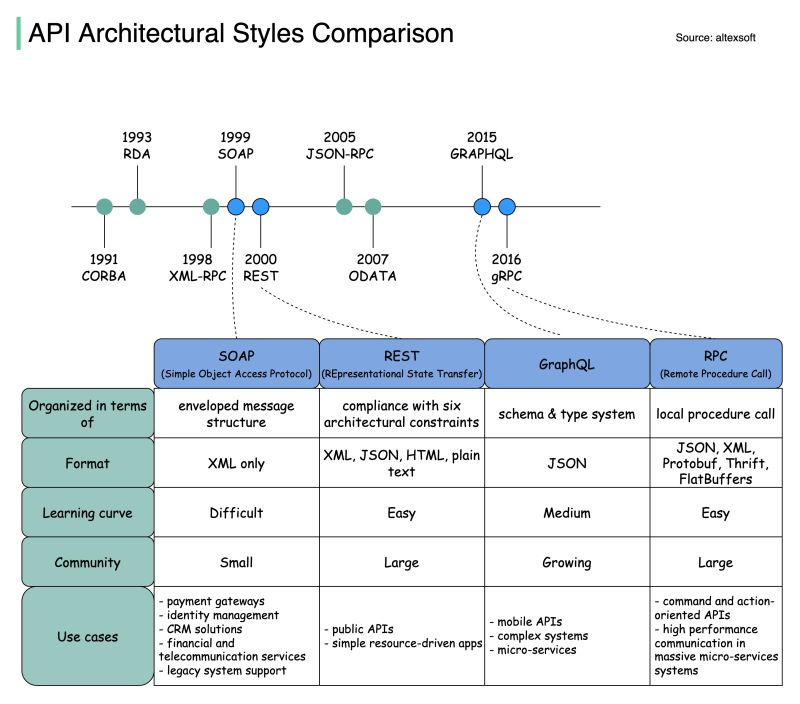

- [REST vs GraphQL - What's the best kind of API?](https://www.youtube.com/watch?v=PeAOEAmR0D0)

- [What Is GraphQL? REST vs. GraphQL](https://www.youtube.com/watch?v=yWzKJPw_VzM)

- https://medium.com/@sharmapraveen91/grpc-vs-rest-vs-graphql-the-ultimate-api-showdown-for-2025-developers-188320b4dc35