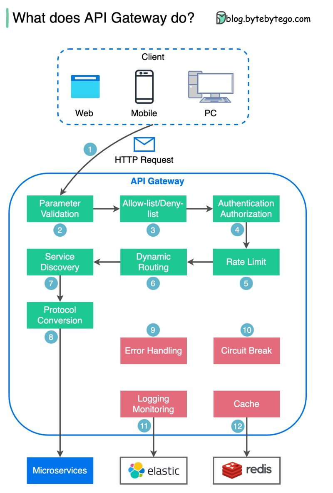

# Api Gateway

An API gateway is an API management tool that sits between a client and a collection of backend services. An API gateway acts as a reverse proxy to accept all application programming interface (API) calls, aggregate the various services required to fulfill them, and return the appropriate result.

https://www.redhat.com/en/topics/api/what-does-an-api-gateway-do#:~:text=An%20API%20gateway%20is%20an,and%20return%20the%20appropriate%20result.

- [Reverse Proxy vs Load Balancer vs API Gateway: The Real Difference](https://www.youtube.com/watch?v=-R5ak7-LiVY)

## The diagram below shows the detail.

Step 1 - The client sends an HTTP request to the API gateway.

Step 2 - The API gateway parses and validates the attributes in the HTTP request.

Step 3 - The API gateway performs allow-list/deny-list checks.

Step 4 - The API gateway talks to an identity provider for authentication and authorization.

Step 5 - The rate limiting rules are applied to the request. If it is over the limit, the request is rejected.

Steps 6 and 7 - Now that the request has passed basic checks, the API gateway finds the relevant service to route to by path matching.

Step 8 - The API gateway transforms the request into the appropriate protocol and sends it to backend microservices.

Steps 9-12: The API gateway can handle errors properly, and deals with faults if the error takes a longer time to recover (circuit break). It can also leverage ELK (Elastic-Logstash-Kibana) stack for logging and monitoring. We sometimes cache data in the API gateway.

#### What is API Gateway?
https://www.youtube.com/watch?v=6ULyxuHKxg8

𝐖𝐡𝐚𝐭 𝐢𝐬 𝐚𝐧 𝐀𝐏𝐈 𝐆𝐚𝐭𝐞𝐰𝐚𝐲?
An API gateway is a type of middleware that sits between a client and a collection of backend services, acting as a reverse proxy.

Its main purpose is to route requests from clients to the appropriate microservice and then to return the response from the microservice back to the client.

Here are the top 10 use cases of API Gateway:

1. 𝐑𝐨𝐮𝐭𝐢𝐧𝐠: Directs incoming API requests to the appropriate backend service.
2. 𝐀𝐮𝐭𝐡𝐞𝐧𝐭𝐢𝐜𝐚𝐭𝐢𝐨𝐧 𝐚𝐧𝐝 𝐀𝐮𝐭𝐡𝐨𝐫𝐢𝐳𝐚𝐭𝐢𝐨𝐧: Validates user or service credentials before granting access to APIs.
3. 𝐑𝐚𝐭𝐞 𝐋𝐢𝐦𝐢𝐭𝐢𝐧𝐠: Controls the number of requests a user can make to prevent API abuse.
4. 𝐀𝐏𝐈 𝐌𝐞𝐭𝐞𝐫𝐢𝐧𝐠 𝐚𝐧𝐝 𝐁𝐢𝐥𝐥𝐢𝐧𝐠: Tracks API usage for reporting, analytics, or billing purposes.
5. 𝐋𝐨𝐠𝐠𝐢𝐧𝐠 𝐚𝐧𝐝 𝐌𝐨𝐧𝐢𝐭𝐨𝐫𝐢𝐧𝐠: Captures and reports on API traffic for performance and debugging.
6. 𝐋𝐨𝐚𝐝 𝐁𝐚𝐥𝐚𝐧𝐜𝐢𝐧𝐠: Distributes incoming API calls across multiple backend services to ensure scalability and reliability.
7. 𝐑𝐞𝐬𝐩𝐨𝐧𝐬𝐞 𝐂𝐚𝐜𝐡𝐢𝐧𝐠: Stores copies of frequent API responses to improve response time and reduce backend load.
8. 𝐑𝐞𝐪𝐮𝐞𝐬𝐭 𝐚𝐧𝐝 𝐑𝐞𝐬𝐩𝐨𝐧𝐬𝐞 𝐓𝐫𝐚𝐧𝐬𝐟𝐨𝐫𝐦𝐚𝐭𝐢𝐨𝐧: Modifies API requests and responses as they pass through the gateway to ensure compatibility between different API versions or services.
9. 𝐂𝐫𝐨𝐬𝐬-𝐎𝐫𝐢𝐠𝐢𝐧 𝐑𝐞𝐬𝐨𝐮𝐫𝐜𝐞 𝐒𝐡𝐚𝐫𝐢𝐧𝐠 (𝐂𝐎𝐑𝐒) 𝐌𝐚𝐧𝐚𝐠𝐞𝐦𝐞𝐧𝐭: Handles CORS requests to allow or restrict resources to be requested from another domain.
10. 𝐀𝐏𝐈 𝐕𝐞𝐫𝐬𝐢𝐨𝐧 𝐌𝐚𝐧𝐚𝐠𝐞𝐦𝐞𝐧𝐭: Routes requests to different backend service versions, enabling smooth transitions between API versions.

https://media.licdn.com/dms/image/v2/D4D22AQHBVlIsKp7xtA/feedshare-shrink_2048_1536/B4DZP.4bD5GUAo-/0/1735148029390?e=1740009600&v=beta&t=cTQG6obh89JvUx4SvWKXku4GoVvO1oBv8TuiU929jLU