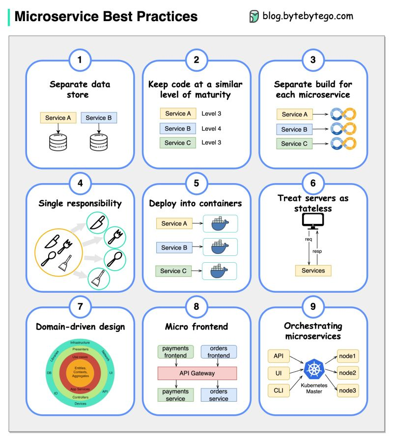

## Best practices on develop microservices
1. Use separate data storage for each microservice
2. Keep code at a similar level of maturity
3. Separate build for each microservice
4. Assign each microservice with a single responsibility
5. Deploy into containers
6. Design stateless services
7. Adopt domain-driven design
8. Design micro frontend
9. Orchestrating microservices

