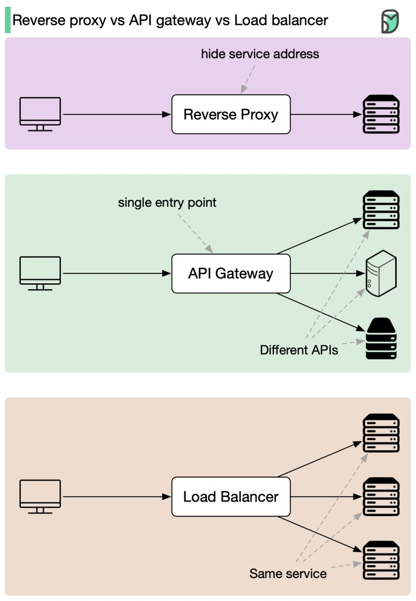

# System Design

*System Design is defined as a process of creating an architecture for different components, interfaces, and modules of the system and providing corresponding data helpful in implementing such elements in systems.*

System Design is the process of designing the architecture, components, and interfaces for a system so that it meets the end-user requirements. Almost every IT giant whether it be Facebook, Amazon, Google, Apple or any other ask various questions based on System Design concepts such as scalability, load-balancing, caching, etc. in the interview. This specifically designed System Design tutorial will help you to learn and master System Design concepts in the most efficient way from basics to advanced level.

System design refers to the process of defining the architecture, modules, interfaces, data for a system to satisfy specified requirements. It is a multi-disciplinary field that involves trade-off analysis, balancing conflicting requirements, and making decisions about design choices that will impact the overall system.

#### Here are some steps for approaching a system design tutorial:
* Understand the requirements: Before starting the design process, it is important to understand the requirements and constraints of the system. This includes gathering information about the problem space, performance requirements, scalability needs, and security concerns.
* Identify the major components: Identify the major components of the system and how they interact with each other. This includes determining the relationships between different components and how they contribute to the overall functionality of the system.
* Choose appropriate technology: Based on the requirements and components, choose the appropriate technology to implement the system. This may involve choosing hardware and software platforms, databases, programming languages, and tools.
* Define the interface: Define the interface between different components of the system, including APIs, protocols, and data formats.
* Design the data model: Design the data model for the system, including the schema for the database, the structure of data files, and the data flow between components.
* Consider scalability and performance: Consider scalability and performance implications of the design, including factors such as load balancing, caching, and database optimization.
* Test and validate the design: Validate the design by testing the system with realistic data and use cases, and make changes as needed to address any issues that arise.
* Deploy and maintain the system: Finally, deploy the system and maintain it over time, including fixing bugs, updating components, and adding new features as needed.

It’s important to keep in mind that **system design is an iterative process**, and the design may change as new information is gathered and requirements evolve. Additionally, it’s important to communicate the design effectively to all stakeholders, including developers, users, and stakeholders, to ensure that the system meets their needs and expectations.

(https://www.geeksforgeeks.org/system-design-tutorial/)

## Types of Systems in System Analysis and Design
Now that we have understood what is System Analysis and how System Analysis is different from System Design, it is now imperitive that we analyze the types of systems in System Design. Generally, the systems can be categorised into two broad categories:

- **Monolithic** Systems
- **Distributed** Systems built with help of Microservices

(https://www.geeksforgeeks.org/analysis-of-monolithic-and-distributed-systems-learn-system-design/?ref=lbp)

## System Design Concepts

#### 20 System Design Concepts Explained in 10 Minutes
https://www.youtube.com/watch?v=i53Gi_K3o7I

### Vertical Scaling

### Horizontal Scaling

### Load Balancers

### Content Delivery Networks

### Caching

### IP Address

### TCP / IP

### IP Address

### Domain Name System

### HTTP

### REST

### GraphQL

### gRPC

### WebSockets

### SQL

### ACID

### NoSQL

### Sharding

### Replication

### CAP Theorem

### Message Queues

## Reverse proxy vs. API gateway vs. load balancer

As modern websites and applications are like busy beehives, we use a variety of tools to manage the buzz. Here we'll explore three superheroes: Reverse Proxy, API Gateway, and Load Balancer.

🔹Reverse Proxy: change identity
- Fetching data secretly, keeping servers hidden.
- Perfect for shielding sensitive websites from cyber-attacks and prying eyes.

🔹API Gateway: postman
- Delivers requests to the right services.
- Ideal for bustling applications with numerous intercommunicating services.

🔹Load Balancer: traffic cop
- Directs traffic evenly across servers, preventing bottlenecks
- Essential for popular websites with heavy traffic and high demand.

In a nutshell, choose a Reverse Proxy for stealth, an API Gateway for organized communications, and a Load Balancer for traffic control. Sometimes, it's wise to have all three - they make a super team that keeps your digital kingdom safe and efficient.

## Sources
https://en.wikipedia.org/wiki/Systems_design \
https://en.wikipedia.org/wiki/Architectural_pattern \
https://en.wikipedia.org/wiki/Software_architecture