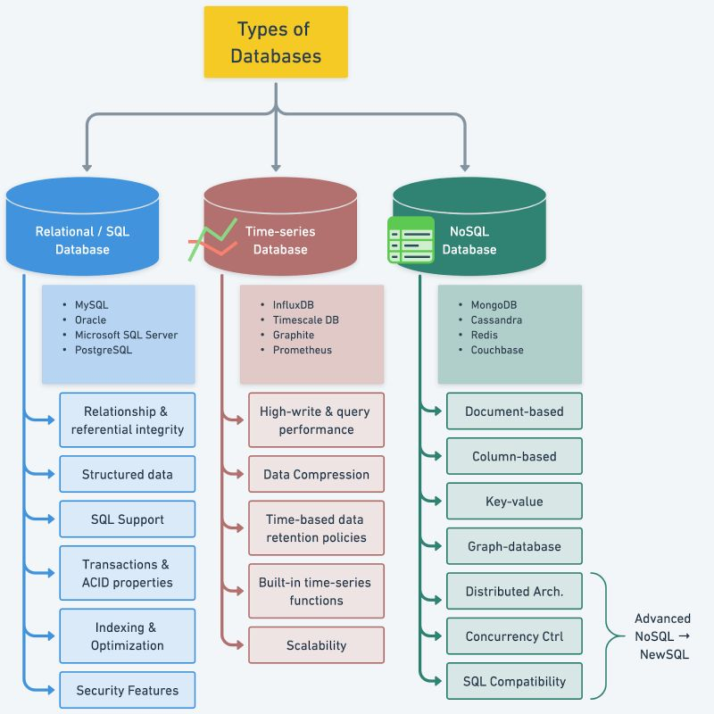

# Data Bases

To make the best decision for our projects, it is essential to understand the various types of databases available in the market. We need to consider key characteristics of different database types, including popular options for each, and compare their use cases.

# Most Common Data Structures
https://www.youtube.com/watch?v=ouipSd_5ivQ

## List
Twiter feeds

## Array
Math operations and large data sets

## Stack
Undo/Redo of word editor

## Queue
Printer jobs or user actions in game

## Heap
Task scheduling

## Tree
HML dcument or AI decision

## Suffix tree
Search string in document

## Graph
Friendship tracking or Path finding

## R-tree
Nearest neibourgh

## Hash table
Caching systems