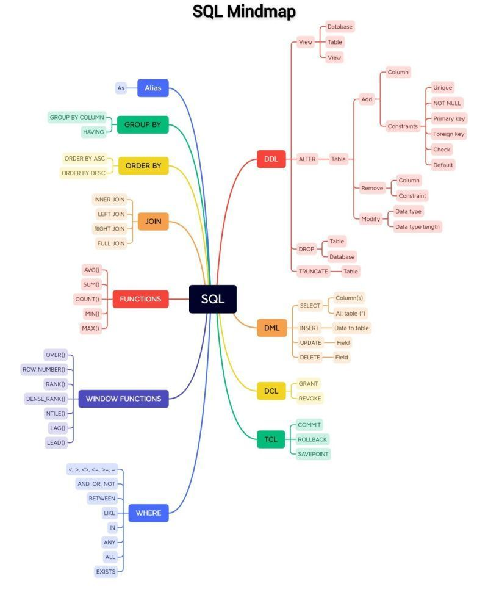

#### Learn SQL In 60 Minutes
https://www.youtube.com/watch?v=p3qvj9hO_Bo

#### Learn SQL in 1 Hour - SQL Basics for Beginners
https://www.youtube.com/watch?v=9Pzj7Aj25lw

#### SQL Joins Tutorial for Beginners - Inner Join, Left Join, Right Join, Full Outer Join
https://www.youtube.com/watch?v=2HVMiPPuPIM

#### SQL CTEs (Common Table Expressions) - Why and How to Use Them
https://www.youtube.com/watch?v=ZaFMM-vNlvc

#### SQL Indexes - Definition, Examples, and Tips
https://www.youtube.com/watch?v=NZgfYbAmge8

#### Protect from SQL Injection
https://www.crowdstrike.com/cybersecurity-101/sql-injection/

#### Data Modeling
https://blog.devart.com/types-of-relationships-in-sql-server-database.html \
https://medium.com/clarusway/types-of-relationships-in-data-modelling-2d5138aa62b4 \
https://support.microsoft.com/en-us/office/relationships-between-tables-in-a-data-model-533dc2b6-9288-4363-9538-8ea6e469112b \

#### How to Create a Simple MySQL Stored Procedure
https://www.youtube.com/watch?v=7ReXGwNrw5g

#### You don't need NoSQL (use MySQL)
https://www.youtube.com/watch?v=QZBxgX2OWbI