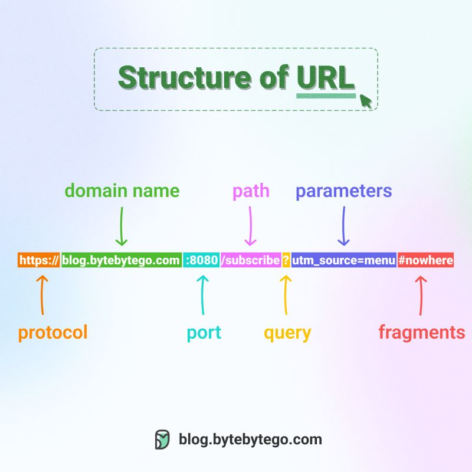
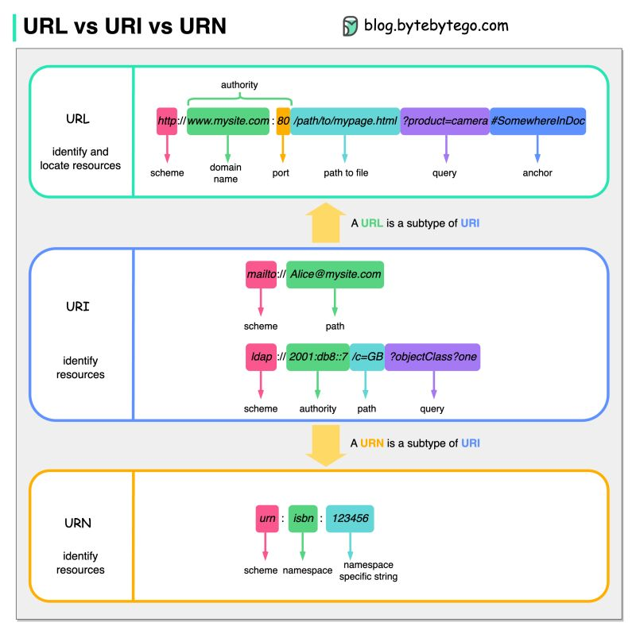
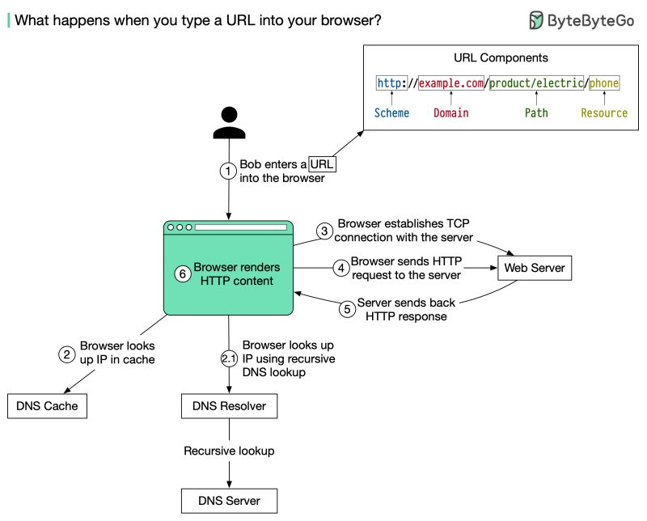

# HTTP
...

Uniform Resource Locator (URL) is a term familiar to most people, as it is used to locate resources on the internet. When you type a URL into a web browser's address bar, you are accessing a "resource", not just a webpage. URLs comprise several components:
- The protocol or scheme, such as http, https, and ftp.
- The domain name and port, separated by a period (.)
- The path to the resource, separated by a slash (/)
- The parameters, which start with a question mark (?) and consist of key-value pairs, such as a=b&c=d.
- The fragment or anchor, indicated by a pound sign (#), which is used to bookmark a specific section of the resource.
<div style="width:50%;margin:0 0 0 25%"></div>

<div style="width:50%;margin:0 0 0 25%"></div>

## typing a URL into browsers
The diagram below illustrates the steps.

1. A user enters a URL into the browser and hits Enter. In this example, the URL is composed of 4 parts:
- scheme - http://. This tells the browser to send a connection to the server using HTTP.
- domain - example .com. This is the domain name of the site.
- path - product/electric. It is the path on the server to the requested resource: phone.
- resource - phone. It is the name of the resource Bob wants to visit.

2. The browser looks up the IP address for the domain with a domain name system (DNS) lookup. To make the lookup process fast, data is cached at different layers: browser cache, OS cache, local network cache, and ISP cache. \
2.1 If the IP address cannot be found at any of the caches, the browser goes to DNS servers to do a recursive DNS lookup until the IP address is found (this will be covered in another post).

3. Now that we have the IP address of the server, the browser establishes a TCP connection with the server.

4. The browser sends an HTTP request to the server. The request looks like this:
```
𝘎𝘌𝘛 /𝘱𝘩𝘰𝘯𝘦 𝘏𝘛𝘛𝘗/1.1
𝘏𝘰𝘴𝘵: 𝘦𝘹𝘢𝘮𝘱𝘭𝘦.𝘤𝘰𝘮
```

5. The server processes the request and sends back the response. For a successful response (the status code is 200). The HTML response might look like this:
```
𝘏𝘛𝘛𝘗/1.1 200 𝘖𝘒
𝘋𝘢𝘵𝘦: 𝘚𝘶𝘯, 30 𝘑𝘢𝘯 2022 00:01:01 𝘎𝘔𝘛
𝘚𝘦𝘳𝘷𝘦𝘳: 𝘈𝘱𝘢𝘤𝘩𝘦
𝘊𝘰𝘯𝘵𝘦𝘯𝘵-𝘛𝘺𝘱𝘦: 𝘵𝘦𝘹𝘵/𝘩𝘵𝘮𝘭; 𝘤𝘩𝘢𝘳𝘴𝘦𝘵=𝘶𝘵𝘧-8

<!𝘋𝘖𝘊𝘛𝘠𝘗𝘌 𝘩𝘵𝘮𝘭>
<𝘩𝘵𝘮𝘭 𝘭𝘢𝘯𝘨="𝘦𝘯">
𝘏𝘦𝘭𝘭𝘰 𝘸𝘰𝘳𝘭𝘥
</𝘩𝘵𝘮𝘭>
```

6. The browser renders the HTML content.

<div style="width:50%;margin:0 0 0 25%"></div>


## HTTP 1.0 -> HTTP 1.1 -> HTTP 2.0 -> HTTP 3.0
What problem does each generation of HTTP solve?

The diagram below illustrates the key features.

🔹HTTP 1.0 was finalized and fully documented in 1996. Every request to the same server requires a separate TCP connection.

🔹HTTP 1.1 was published in 1997. A TCP connection can be left open for reuse (persistent connection), but it doesn’t solve the HOL (head-of-line) blocking issue.

HOL blocking - when the number of allowed parallel requests in the browser is used up, subsequent requests need to wait for the former ones to complete.

🔹HTTP 2.0 was published in 2015. It addresses HOL issue through request multiplexing, which eliminates HOL blocking at the application layer, but HOL still exists at the transport (TCP) layer.

As you can see in the diagram, HTTP 2.0 introduced the concept of HTTP “streams”: an abstraction that allows multiplexing different HTTP exchanges onto the same TCP connection. Each stream doesn’t need to be sent in order.

🔹HTTP 3.0 first draft was published in 2020. It is the proposed successor to HTTP 2.0. It uses QUIC instead of TCP for the underlying transport protocol, thus removing HOL blocking in the transport layer.

QUIC is based on UDP. It introduces streams as first-class citizens at the transport layer. QUIC streams share the same QUIC connection, so no additional handshakes and slow starts are required to create new ones, but QUIC streams are delivered independently such that in most cases packet loss affecting one stream doesn't affect others.

<div style="width:50%;margin:0 0 0 25%"></div>

## HTTP Methods
https://developer.mozilla.org/en-US/docs/Web/HTTP/Methods

## The Different HTTP Status Codes Explained
There are five different HTTP status code categories (or classes). Each one represents a different response from the server to the browser.

#### La importancia de unificar las respuestas de nuestras API en microservicios
https://youtu.be/5BoyfHgzW2E?t=152

#### 1XX — Informational codes
The server acknowledges and is processing the request.

#### 2XX — Success codes
The server successfully received, understood, and processed the request.

#### 3XX — Redirection codes
The server received the request, but there’s a redirect to somewhere else (or, in rare cases, some additional action other than a redirect must be completed).

#### 4XX — Client error codes
The server couldn’t find (or reach) the page or website. This is an error on the site’s side.

#### 5XX — Server error codes
The client made a valid request, but the server failed to complete the request.

## 1XX HTTP Status Codes
This category is informational, temporary, and invisible to the client. It indicates the server received the request and will proceed with it.

100 — Continue: This interim status code means the server received the initial request, and the client should continue.

101 — Switching protocols: This code is a response to an Upgrade header field request and states the protocol the server will switch to.

102 — Processing: This response indicates the server received and is processing the request, but no response is yet available.

103 — Early hints: This code is used with the Link header and allows the browser to preload resources while the server prepares a response.

## 2XX HTTP Status Codes
This status code category encompasses successful responses.

200 — OK: This is the standard response for successful HTTP requests. The actual meaning of the response depends on the request method used:
GET: Resource obtained and is in the message body\
HEAD: Headers are included in the response\
POST or PUT: Resource describing the result of the action sent is in the message body\
TRACE: Message body contains the request message as received by the server

201 — Created: The request succeeded and a new resource was created. This is usually the response after POST or PUT requests.

202 — Accepted: The request was accepted but is still in progress. It’s used for cases where another server handles the request or for batch processing.

203 — Non-Authoritative Information: The data returned isn’t from the origin server. Instead, it’s a modified version collected from a third party.

204 — No Content: The request was successfully processed, but there is no content. The headers may be useful.

205 — Reset Content: The server fulfilled the request but asked the user to reset the document.

206 — Partial Content: The server is delivering part of the resource. This response is used when the client sends a Range header to request only part of a resource.

207 — Multi-Status: Provides the statuses of multiple resources, depending on how many sub-requests were made.

208 — Already Reported: The members of a DAV:propstat element have already been listed and won’t be included again.

226 — IM used: The server completed a GET request. And the response indicates one or more instance-manipulation results.

## 3XX HTTP Status Codes
The status codes in this category show the resource is in a different location, and the user gets redirected as a result.

300 — Multiple Choice: The request has more than one possible response. And the user should choose one of them.

301 — Moved Permanently: This redirect status code indicates the requested resource has permanently moved to a new URL. The browser displays the new URL.

302 — Found: Previously known as “Moved Temporarily,” this code indicates the requested resource has temporarily moved to a new URL.

303 — See Other: The server redirects the user to the requested resource with a GET request at another URL.

304 — Not Modified: Used for caching purposes. The response hasn’t been modified, so the client can continue to use the same cached version of the requested resource.

307 — Temporary Redirect: The requested resource temporarily moved to a different URL. The only difference vis-a-vis the 302 code is the user must not change the HTTP method used.

308 — Permanent Redirect: The requested resource permanently moved to a different URL. The difference between this code and 301 is the user must not change the HTTP request method.

## 4XX HTTP Status Codes
This category indicates the server can’t reach a page due to an error on the client side.

400 — Bad Request: The server can’t or won’t process the request due to a client error. For example, invalid request message framing, deceptive request routing, size too large, etc.

401 — Unauthorized: The user doesn’t have valid authentication credentials to get the requested resource.

402 — Payment Required: Reserved for future use; it was initially intended for digital payment systems. It’s very rarely used, and no standard convention regulates it.

403 — Forbidden: The client doesn’t have access rights to the content. For example, it may require a password. Unlike the 401 HTTP error code, the server does know the client’s identity.

404 — Not Found: The server can’t find the requested resource, and no redirection has been set. 404 errors can harm your SEO efforts.

405 — Method Not Allowed: The server supports the request method, but the target resource doesn’t.

406 — Not Acceptable: The server doesn’t find any content that satisfies the criteria given by the user according to the Accept headers requested.

407 — Proxy Authentication Required: This is similar to a 401, but a proxy must authenticate the client to continue.

408 — Request Timeout: The server timed out waiting because the client didn’t produce a request within the allotted time.

409 — Conflict: The server can’t fulfill the request because there’s a conflict with the resource. It’ll display information about the problem so the client can fix it and resubmit.

410 — Gone: The content requested has been permanently deleted from the server and will not be reinstated.

411 — Length Required: The server rejects the request because it requires a defined

Content-Length header field.

412 — Precondition Failed: The client indicates preconditions in the header fields that the server fails to meet.

413 — Payload Too Large: The client’s request is larger than the server’s defined limits, and the server refuses to process it.

414 — URI Too Long: The URI (Uniform Resource Identifier) requested by the client is too long for the server to process.

415 — Unsupported Media Type: The request uses a media format the server does not support.

416 — Range Not Satisfiable: The server can’t fulfill the value indicated in the request’s Range header field.

417 — Expectation Failed: The server can’t meet the requirements indicated by the Expect request header field.

421 — Misdirected Request: The client sends a request to a server that can’t produce a response.

422 — Unprocessable Entity: The client correctly sends the request, but the server can’t process it because of semantic errors or similar issues.

423 — Locked: The requested method’s resource is locked and inaccessible.

424 — Failed Dependency: The request failed because a request the initial request depended on also failed.

425 — Too Early: The server is unwilling to process a request that might be replayed.

426 — Update Required: The server refuses to process the request using the current protocol unless the client upgrades to a different protocol.

428 — Precondition Required: The server needs the request to be conditional.

429 — Too Many Requests: The user sends too many requests in a certain amount of time.

431 — Request Header Fields Too Large: The server can’t process the request because the header fields are too large.

451 — Unavailable for Legal Reasons: The user requests a resource the server can’t legally provide.

## 5XX HTTP Status Codes
This category includes errors on the server side.

They can be detrimental to your SEO, as search engines can prompt crawlers to slow down with crawling and remove indexed URLs that continually return these errors.

500 — Internal Server Error: The server has encountered an unexpected error and cannot complete the request.

501 — Not Implemented: The server can’t fulfill the request or doesn’t recognize the request method.

502 — Bad Gateway: The server acts as a gateway and gets an invalid response from an inbound host.

503 — Service Unavailable: The server is unable to process the request. This often occurs when a server is overloaded or down for maintenance.

504 — Gateway Timeout: The server was acting as a gateway or proxy and timed out, waiting for a response.

505 — HTTP Version Not Supported: The server doesn’t support the HTTP version in the request.

506 — Variant Also Negotiates: The server has an internal configuration error.

507 — Insufficient Storage: The server doesn’t have enough storage to process the request successfully.

508 — Loop Detected: The server detects an infinite loop while processing the request.

511 — Network Authentication Required: The client must be authenticated to access the network. The error should include a link where the user can submit credentials.

## HTTP Status Codes and SEO
Search engine bots, like Google’s Googlebot, record status codes as they crawl your site and use the data to evaluate your site’s health.

Which impacts your site’s SEO.

Here are the most important HTTP status codes to know and understand if you’re concerned about SEO:

200 OK
The 200 HTTP status code is a success message. It indicates that the page functions properly for bots and visitors.

This is the status code you should expect to see for every important, functioning page on your site.

301 Moved Permanently
301 redirect codes mean bots and visitors who land on the page will be redirected to another URL.

Use 301 redirects to inform search engines that the redirect is permanent and that link equity should pass through to the new URL.

404 Page Not Found
A 404 HTTP status code may negatively impact your site’s SEO performance.

Search engines won’t index pages that return a 404 error. And any backlinks pointing to it will no longer give link value to the page.

If the site returns an error by mistake, fix it immediately. Especially if it’s an important page in terms of traffic, ranking, ecommerce value, etc.

The best practice is to create a 301 redirect to a similar page that serves the same intent.

However, if you don’t have a relevant page to redirect users to, you can create a custom 404 page.

Custom 404 pages help visitors find what they’re looking for and encourage them to explore your site.

5XX Server Errors
Server errors affect access to your site. Which means they can hurt your rankings and cause a negative user experience.

5XX server errors also slow down the crawling process. If the problem persists, search engines may deem your site low-quality and can deindex the pages returning these errors.

Keep a close eye on these status codes and fix them as soon as possible.

## Sources
https://www.linkedin.com/company/bytebytego/posts/

#### HTTP Crash Course & Exploration
https://www.youtube.com/watch?v=iYM2zFP3Zn0
